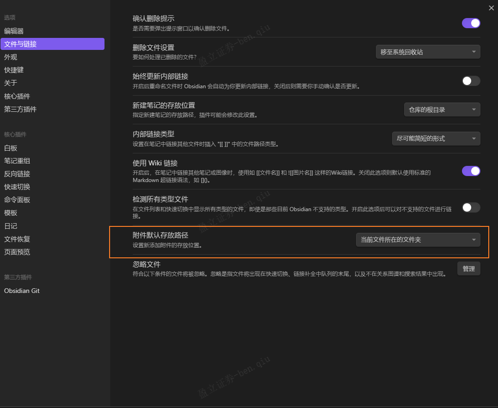
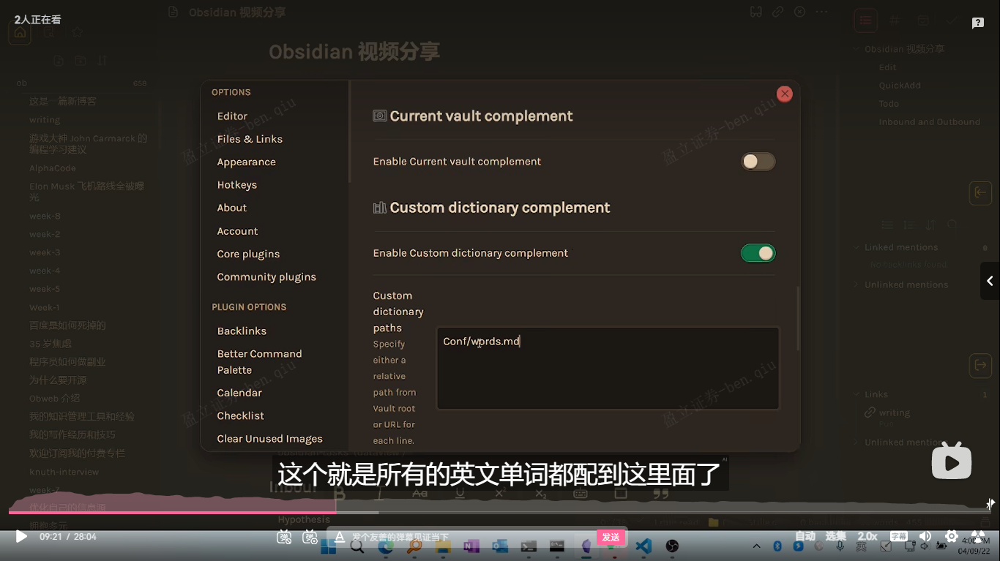
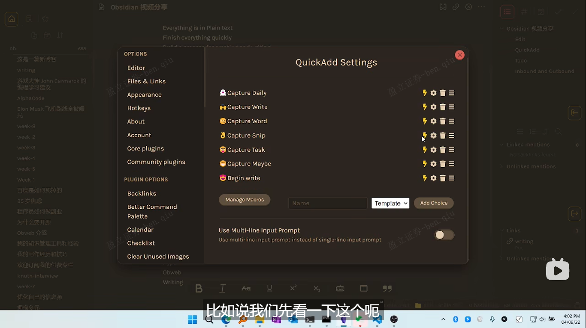
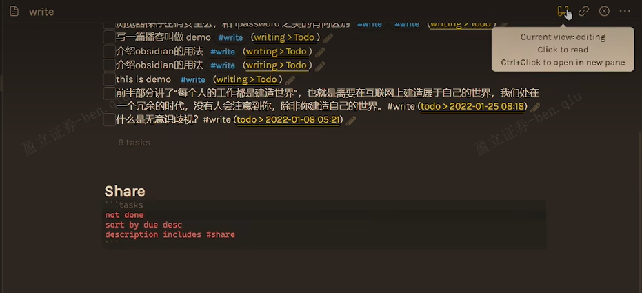
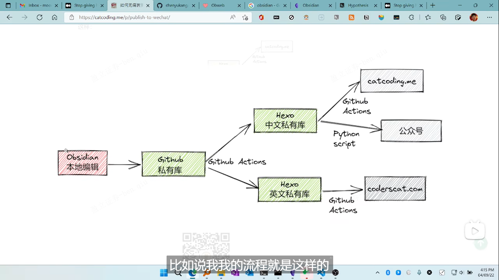

## Obsidian笔记自动化

### 基础配置

- 快捷键（自行配置）
- 命令面板（`Ctrl+P`）
- 快速切换（查快捷键）
- 视图切换（`Ctrl+E`）
- 双链绑定
- 外观
- 核心插件
- 第三方插件

​	

### Obsidian插件

- obsidian-git插件：可自动部署到github查库
- paste picture（非插件，贴图，将图片资源存放置同一目录下）
  - 但是我已经有typora的相对目录存储了
- obsidian-various-complements-plugin（补全插件）
  - 可以像up主这样配一个自己的高频词典（有需求的话）
- QuickAdd：可以配置日常要做的task
  - capture xxx 去定义你的文件，并为文件初始化模板信息，每次可通过命令面板创建task（待会自己试试，也可以再搜搜网上详细教程）
  - 我们每天可能都会有一个日报，里面可能有task，我们可以通过像sql去汇集这么还没完成的task到同一文件下（pending task），而当我们再pending task勾选我们其中这一task的时候，相对于日报里的这个task也会勾选完成，这样子就很方便（即使to do散落在任何地方），但是通过一个地方去集中展示（不然全部集中在一个地方就会很乱）
- Hypothes.is：连接谷歌Hypothesis插件进行网页标注，可以定义下拉pull时长，它会把你浏览器标注的信息下拉到obsidian你指定的目录，打通输入输出，把标注文件重新分享书写思考

​	

