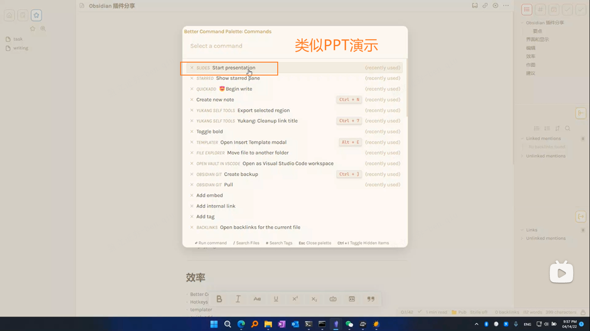
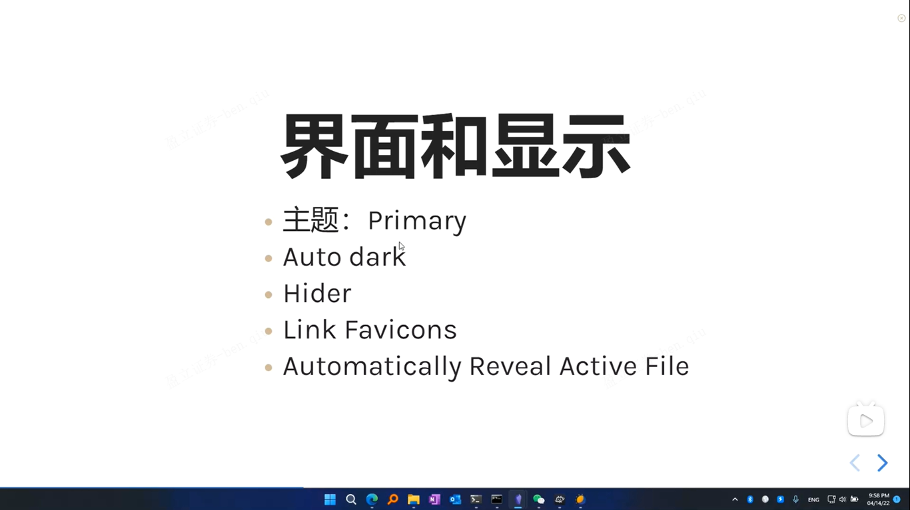
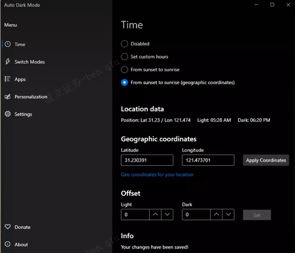
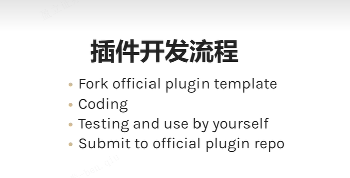
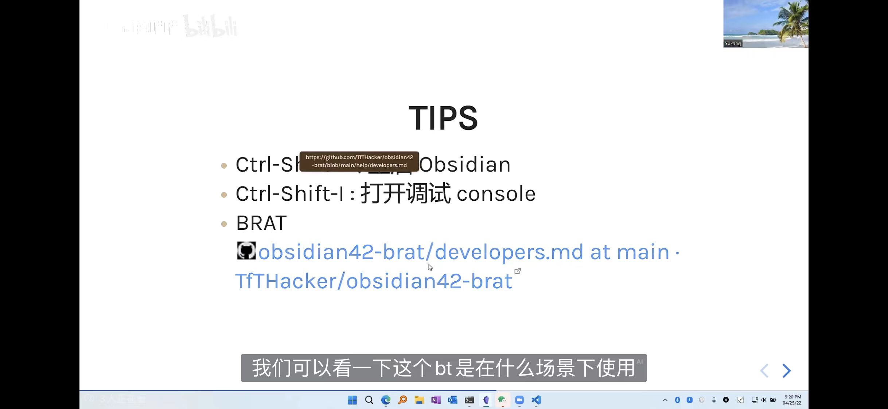
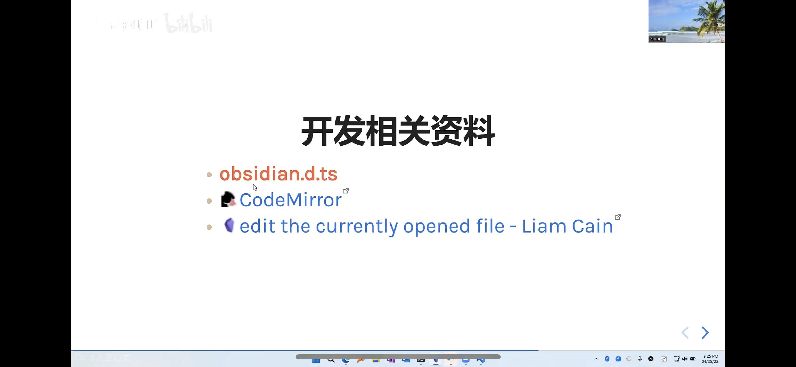
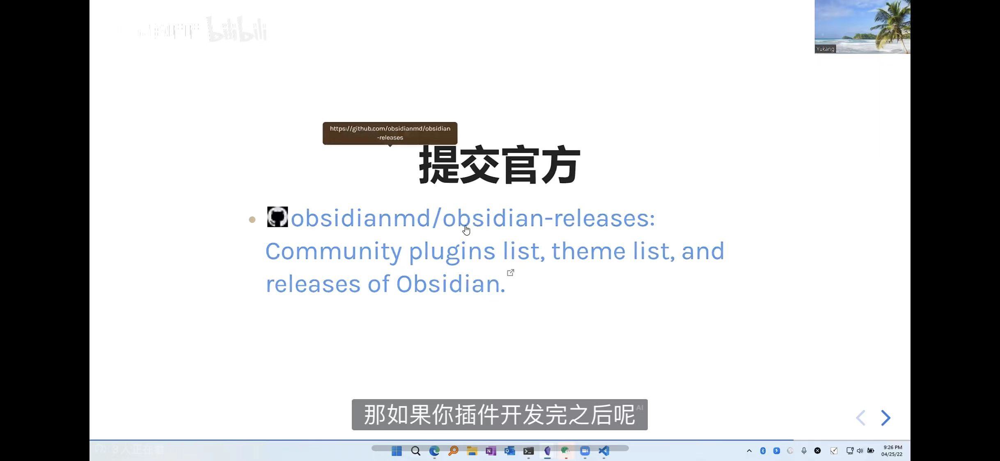
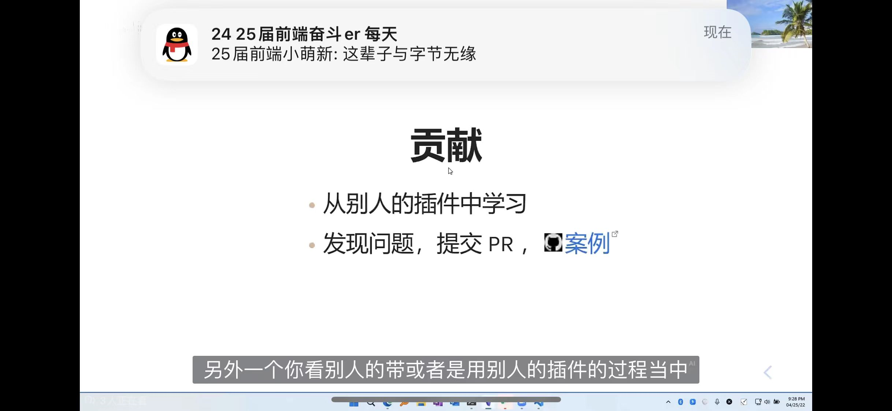

## Obsidian笔记自动化

> 作者文章：https://catcoding.me/p/obsidian-for-programmer/

### 基础配置

- 快捷键（自行配置）
- 命令面板（`Ctrl+P`）
- 快速切换（查快捷键）
- 视图切换（`Ctrl+E`）
- 双链绑定
- 外观
- 核心插件
- 第三方插件

​	

### Obsidian插件

- obsidian-git插件：可自动部署到github查库
- paste picture（非插件，贴图，将图片资源存放置同一目录下）
  - 但是我已经有typora的相对目录存储了
- obsidian-various-complements-plugin（补全插件）
  - 可以像up主这样配一个自己的高频词典（有需求的话）
- QuickAdd：可以配置日常要做的task
  - capture xxx 去定义你的文件，并为文件初始化模板信息，每次可通过命令面板创建task（待会自己试试，也可以再搜搜网上详细教程）
  - 我们每天可能都会有一个日报，里面可能有task，我们可以通过像sql去汇集这么还没完成的task到同一文件下（pending task），而当我们再pending task勾选我们其中这一task的时候，相对于日报里的这个task也会勾选完成，这样子就很方便（即使to do散落在任何地方），但是通过一个地方去集中展示（不然全部集中在一个地方就会很乱）
- Hypothes.is：连接谷歌Hypothesis插件进行网页标注，可以定义下拉pull时长，它会把你浏览器标注的信息下拉到obsidian你指定的目录，打通输入输出，把标注文件重新分享书写思考

​	


​	

## 第二期插件推荐



 

windows小软件，根据日出日落更换系统主题



​	

[up主Obsidian自用所有插件](https://github.com/chenyukang/share/blob/main/tools/obsidian/community-plugins.json)

```json
[
  "obsidian-rename-image",
  "obsidian-divide-and-conquer",
  "obsidian-better-command-palette",
  "calendar",
  "cm-editor-syntax-highlight-obsidian",
  "cmenu-plugin",
  "copy-url-in-preview",
  "cycle-through-panes",
  "dataview",
  "easy-typing-obsidian",
  "editor-commands-remap",
  "extract-url",
  "file-explorer-note-count",
  "hotkeysplus-obsidian",
  "link-favicon",
  "nldates-obsidian",
  "note-refactor-obsidian",
  "obsidian-checklist-plugin",
  "obsidian-code-block-enhancer",
  "obsidian-code-copy",
  "obsidian-contextual-typography",
  "obsidian-cursor-location-plugin",
  "obsidian-emoji-toolbar",
  "obsidian-excalidraw-plugin",
  "obsidian-enhancing-mindmap",
  "obsidian-focus-mode",
  "obsidian-footnotes",
  "obsidian-git",
  "obsidian-hider",
  "obsidian-hotkeys-for-specific-files",
  "obsidian-hypothesis-plugin",
  "obsidian-key-sequence-shortcut",
  "obsidian-kindle-plugin",
  "obsidian-local-images",
  "obsidian-plugin-todo",
  "obsidian-reading-time",
  "obsidian-remember-file-state",
  "obsidian-rich-links",
  "obsidian-show-file-path",
  "obsidian-smarter-md-hotkeys",
  "obsidian-stille",
  "obsidian-system-dark-mode",
  "obsidian-tasks-plugin",
  "obsidian-view-mode-by-frontmatter-yukang",
  "obsidian-zoom",
  "obsidian42-brat",
  "open-vscode",
  "oz-clear-unused-images",
  "quickadd",
  "shortcuts-extender",
  "simple-embeds",
  "sliding-panes-obsidian",
  "templater-obsidian",
  "various-complements",
  "obsidian-yukang-self-tools",
  "obsidian-reveal-active-file"
]
```

templater 模板片段插件

QuickAdd

作图

- excalidraw（手绘风格）
- Mind Map（根据markdown文档标题生成思维导图预览）

​	

## Obsidian插件开发

拥抱开源，fork 官方仓库-开发-自用-好用-合并到远程仓库-别人也可使用



git clone 初始化的 template 项目，main.ts 是很好的 API 文档，有注释介绍，齐全

包管理用的是npm，通过 `npm run build` 打包编译，将ts编译为js

在obsidian中 `ctrl+p` 输入vscode可以在vscode打开当前obsidian目录（应该是插件来的）

manifest.json：插件的元数据文件

### Obsidian的插件机制

- manifest.json
- main.js
- style.css

### TIPS

- `ctrl+shift+R` 重启Obsidian

- `ctrl+shift+I` 打开调试 console

- BRAT 

  - ## brat是什么？

  - > Brat是一种开源的文本标注工具，用于标记文本数据中的实体和关系。它是一种用于自然语言处理（NLP）和文本挖掘任务的工具，常用于实体识别、命名实体识别（NER）、事件抽取、关系抽取等。
    >
    > Brat 提供了一个简单而直观的界面，允许用户在文本上进行标注和注释。用户可以在文本中标记实体，如人名、地名、组织名等，也可以标记实体之间的关系，如拥有、位于等。这些标记的数据可以被用于训练机器学习模型，从而进行自动化的实体识别和关系抽取。
    >
    > Brat 的优点之一是其灵活性和易用性。用户可以根据特定任务的需求自定义标记类型和关系类型，因此适用于不同领域和语言的文本标注。此外，Brat 支持多用户协作，允许多个用户同时标注同一份文本数据，提高标注效率和质量。
    >
    > Brat 项目由斯洛文尼亚计算所（Slovenian Language Technologies Society）发起，它是开源的，可以免费下载和使用。由于其简单易用的特点，Brat 在学术界和研究领域广泛应用于各种文本分析任务，也受到一些企业在自然语言处理项目中的欢迎。

brat 可以做 Beta Testing，开发版插件，跟上传到官方的正式版插件处在不同目录，brat可以给你做(规划)测试，通过下载你开发的github插件地址到本地obsidian






