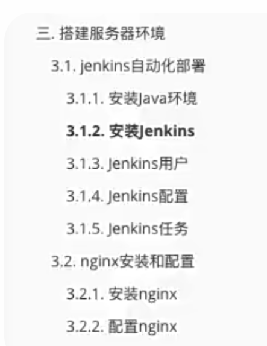

# 搭建服务器环境

### 1. 安装并启动Jenkins代理服务器 （踩坑篇）

视频教学地址应修改为：  （https://pkg.jenkins.io/redhat-stable/）

​	

#### 1.1 下载Jenkins依赖的jdk-11 版本

搭建服务器- jenkins
  yum install fontconfig java-11-openjdk  （jenkins最新版本依赖于11版本）

​	

#### 1.2 安装Jenkins的提前准备

因为Jenkins本身是  没有在dnf的软件仓库包中的,所以我们需要连接Jenkins仓库:

wget是Linux中下载文件的一个工具，-O 表示输出到某个文件夹并且命名文件；
rpm:全称为The RPM Package Manage，是Linux下一个软件包管理器

​	

1. **DNF并未注册- jenkins 需先来连接仓库**
   并导入密匙  声明软件合法 （最新方式）

2. **sudo wget -O /etc/yum.repos.d/jenkins.repo https://pkg.jenkins.io/redhat-stable/jenkins.repo**
   **sudo rpm --import https://pkg.jenkins.io/redhat-stable/jenkins.io-2023.key**

3. **安装适配的jdk版本- 并安装jenkins** 
   yum install fontconfig java-11-openjdk （已提前安装）
     yum install jenkins

#### 1.3  防火墙开启端口8080为可用

注意： Jenkins默认使用8080端口， 需要提前为其开启端口使用性（在腾讯云中启动防火墙 允许进行访问）

💓🐟启动失败： 未配置正确的jdk版本 由于原视频安装为jdk-8导致后期一直失败，重新安装了11-
 		照着步骤走，不会出错

​	

#### 1.4  设置JDK环境变量  并为Jenkins配置 JDK

/usr/lib/jvm/jre-11-openjdk-11.0.19.0.7-1.el7_9.x86_64  （这个为下载后的jdk路径）

运行时需要- 配置环境变量 
（1）进入文件： nano ~/.bashrc
（2）在文件末尾添加： 

		**export JAVA_HOME=/usr/lib/jvm/jre-11-openjdk-11.0.19.0.7-1.el7_9.x86_64** 

（3）退出保存后重新加载文件：  source ~/.bashrc

​	

#### 1.5   配置生效- 解决措施

如配置后失效：  [参考文章 ](https://blog.csdn.net/u012795439/article/details/126587372)

jenkins启动依赖于 ： /usr/lib/systemd/system/jenkins.service文件
（1）nano打开文件： 在java home directory  （三个 Location 后）
（2）将注释去除 ， 为Envioment添加正确的路径 ： 

				Enviroment: "/usr/lib/jvm/jre-11-openjdk-11.0.19.0.7-1.el7_9.x86_64"

（3） 成功启动， 我是用这种方式解决的 （搞了一上午 😓）

​	

#### 1.6 启动Jenkins  并设置开机自启

启动 Jenkins 服务并设置开机自启
**sudo systemctl start jenkins**
**sudo systemctl enable jenkins**

​	

#### 1.7   其它配置（提前配置）

进入/etc/sysconfig/jenkins文件， 将JENKINS_USER = "root" 设置为管理者
后面的定时任务移动需要访问 管理文件（**需要权限**）

**启动配置篇：** 

1. 在浏览器打开 ip地址8080端口：  并配置相关服务/工具   
   在系统中 使用cat /var/lib/jenkins/secrets/initialAdminPassword 找到密码输入

2. 进入选择默认安装所需工具
   注册用户名： Kaden - 密码 W v 123

​	

#### 💓🐟 命令bug解决

​	

[root@VM-8-10-centos lighthouse]# cd ~
bash: __bp_precmd_invoke_cmd: command not found
bash: __bp_interactive_mode: command not found

[参考](https://blog.csdn.net/lzsm_/article/details/126083649)
进入root， 显示隐藏文件

 进入.bashrc文件， 添加一行  **unset PROMPT_COMMAND**

​	

### 2. Nginx中介服务器- 安装及配置

#### 2.1  Nginx的安装

外界访问 是访问到Nginx， 中介转发 数据- 可在之中设置Htps或http， 主要是对服务器进行一个配置， 提高安全性等

​	

dnf install nginx

**启动Nginx并自启动-** 

systemctl start nginx
systenctl status nginx
systemctl enable nginx

​	

**外界访问 是访问到Nginx， 中介转发 数据- 可在之中设置Htps或http， 主要是对服务器尽心一个配置， 提高安全性等**

> 是的，你的理解是正确的。Nginx作为中介服务器的主要作用是接收来自外部的请求，并将这些请求转发到内部的服务器上。这可以实现多种功能，包括负载均衡、反向代理、缓存、HTTPS加密等。
>
> Nginx可以帮助你实现以下目标：
>
> 1. **负载均衡：** Nginx可以将来自多个客户端的请求分发到多个后端服务器上，以平衡负载，提高系统的可靠性和性能。
> 2. **反向代理：** Nginx可以作为反向代理，将外部请求转发到后端服务器，并将响应返回给客户端。这种方式可以隐藏后端服务器的真实IP地址，提供额外的安全性。
> 3. **缓存：** Nginx可以将部分静态内容缓存在内存中，减轻后端服务器的负载，加快响应速度。
> 4. **SSL终止：** Nginx可以处理SSL/TLS加密和解密，将HTTPS请求转发到后端服务器，并在客户端与Nginx之间建立加密连接。
> 5. **安全性：** Nginx可以设置访问控制、防止恶意请求、限制连接数等，提高系统的安全性。
> 6. **HTTP重定向：** Nginx可以将HTTP请求重定向到HTTPS，从而实现网站的安全访问。
> 7. **静态文件服务：** Nginx可以直接提供静态文件，如图片、CSS和JavaScript文件，从而减轻后端服务器的负载。
>
> 总之，Nginx是一个功能强大且高度可配置的中介服务器，可以根据你的需求实现各种不同的功能。你的理解是准确的，如果你想深入了解Nginx的各种用法和配置选项，可以继续学习Nginx的文档和相关资源。

​	

#### 2.2 Nginx配置和使用

#### 1. Nginx配置及使用自动化部署脚本

思路：

Nginx 主要功能: 对用户访问进行转发 ， 需要

1. dnf下载 后对其进行启动（自启动）

2. 使用Remote-ssh去进行连接服务器， 对Systemctl.conf进行修改， 修改后当用户访问ip时将其跳转到cms-mall- Index.html 

   > **location / {**
   > **root root/mall-cms;**
   > **index index.html;**

3. 进入8080端口对jenkins进行配置， 下载node版本（全局工具）14.17.5， 

4. 建立任务， 对项目仓库进行绑定， 需要使用用户名+ token (在GitHub 设置中 生成)  

5. 定义自动部署的时间- * \* \*  \* \*   分 时 日 月 周  原设置为  H H 15 H H 表示每月15号进行拉取仓库进行部署

6. 选择node工具进行拉取， 使用以下指令进行拉取并部署至Mall-cms文件下， 成功后即可通过访问ip直接访问至项目：

**pwd**

**node -v** 
**npm -v**

**npm install**
**npm run build**

**rm -rf /root/mall-cms/***
**mv -rf ./dist/* /root/mall-cms/**

​	

GitHub 一直拉取失败~ 暂时放弃-  构造了两个多钟- 哭死

​	

[手动部署使用软件](https://wpthemeset.lanzoui.com/b06mw70eh)

使用Xshell 和  SFTP（内置插件， 此两个点链接 免费版都行）