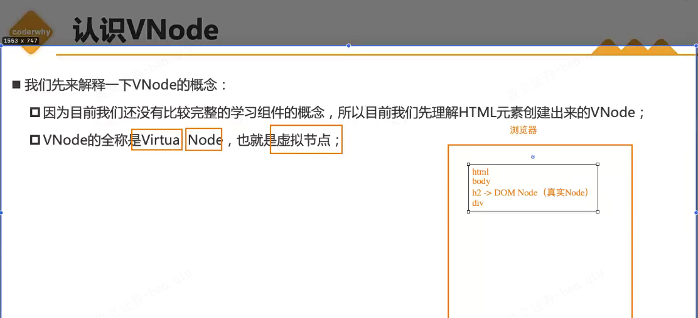

# 01-邂逅Vue3

## 简介

Angular入门门槛高，设计思想与node框架nest.js相似，而且都是用typescript编写


## Vue3库引入使用


> CDN这么看跟域名解析过程有点像，递归查找并缓存


01_Vue3的引入.html

```html
<!-- CDN引入 -->
<body>
  <div id="app"></div>
  <script src="https://unpkg.com/vue@next"></script>
  <script>
    const why = {
      template: `<h2>Hello World!</h2>`,
    }
    const app = Vue.createApp(why);
    app.mount('#app');
  </script>
</body>
```

02_Vue3的引入.html

```html
<!-- 下载打包文件到本地并引入 -->
<body>
  <div id="app"></div>
  <script src='../js/vue.js'></script>
  <script>
    Vue.createApp({
      template:'<h2>Hello World!!!</h2>'
    }).mount('#app');
  </script>
</body>
```

​	

## 计数器案例（原生 & Vue 实现）


03_计数器案例-原生.html

```html
<body>
  <h2 class="counter">0</h2>
  <button class="increment">+1</button>
  <button class="decrement">-1</button>

  <script>
    const counterEl = document.querySelector('.counter');
    const increment = document.querySelector('.increment');
    const decrement = document.querySelector('.decrement');

    let count= 100;
    counterEl.innerHTML=count;

    increment.addEventListener('click',()=>{
      count++;
      counterEl.innerHTML=count;
    })

    decrement.addEventListener('click',()=>{
      count--;
      counterEl.innerHTML=count;
    })
  </script>
</body>
```


> 挂载元素后面可以配置代码片段来快速生成


在template中，vue3最外层给不给div标签都可以，vue2是要的

> 暂时不清楚上图说的另一方式编写有提示指的是什么（答：在template标签进行）

04_计数器案例-Vue.html

```html
<body>
  <div id="app"></div>
  <script src="../js/vue.js"></script>
  <script>
    Vue.createApp({
      // 在template中需要使用元素标签多的情况可以使用模板字符串，比普通单/双字符串方便
      template: `
        <div>
          <h2>{{message}}</h2>
          <h2>{{count}}</h2>
          <button @click='increment'>+1</button>
          <button @click='decrement'>-1</button>  
        </div>
      `,
      // 在vue2中，data是一个对象，但在vue3中，data是一个函数，我们一般是return一个对象
      // vue使得我们不需要再去进行原生dom绑定，data里返回的属性都会被加入响应式系统中，可以在模板中使用
      data: function(){
        return {
          message:'hello',
          count: 100
        }
      },
      methods:{
        increment(){
          // this拿的其实是proxy代理里的东西，再去获取到data里的属性count（答：这一部分是被Vue的响应式系统劫持）
          this.count++;
        },
        decrement(){
          this.count--;
        }
      }
    }).mount('#app')
  </script>
</body>
```

​	

## 编程范式

分为：

- 命令式编程（原生html）：当下最需要什么去声明然后直接用（获取dom由人完成）
- 声明式编程（Vue）：把需要的东西先声明后绑定进行使用（获取dom由框架完成）


## MVVM & MVC

前端除了MVVM架构，也可以当成MVC架构来看


但MVC这种传统开发模式在前端划分不会那么清晰，不像后端/ios


vue算是MVVM框架，整个设计受到它的启发

vue作为中间层，帮助实现数据双向绑定和dom操作


## template属性

绑定元素标签数据只能是在template标签里绑定数据的，template标签外的不能识别处理（例如单纯在body标签下使用 <div>{{ message }}</div> 类似这种）


在vue中挂载或者绑定标签通常使用id进行绑定/挂载是有含义的，


template标签不是vue特有的，html标签本身就有定义这个template标签，而且它里面的内容默认情况下不会被浏览器渲染，那么它有什么作用呢？

> 作用：被javascript源代码读取，在scirpt标签里去用

^00ee8c

[MDN | <template>：内容模板元素](https://developer.mozilla.org/zh-CN/docs/Web/HTML/Element/template)

虽然解析器在加载页面时确实会处理 **`<template>`** 元素的内容，但这样做只是为了确保这些内容有效；但元素内容不会被渲染。——MDN

05_template写法一.html

```html
<body>
  <div id="app"></div>
  <script src="../js/vue.js"></script>
  <script type="x-template" id="counter">
    <!-- 缺点是没有高亮 -->
    <div>
      <h2>{{ message }}</h2>
      <h2>{{ count }}</h2>
      <button @click='increment'>+1</button>
      <button @click='decrement'>-1</button>  
    </div>
  </script>
  <script>
    Vue.createApp({
      template: '#counter',
      data: function(){
        return {
          message:'hello',
          count: 100
        }
      },
      methods:{
        increment(){
          this.count++;
        },
        decrement(){
          this.count--;
        }
      }
    }).mount('#app')
  </script>
</body>
```

---


如果用的不是template标签而是其他标签（例如div标签），那么页面会被渲染两次的（一次是原生渲染一次是经过vue处理后渲染），为什么会这样？

> 上面刚刚已经说明了原因，template标签是不会被浏览器渲染（看上面写的[[note#^00ee8c | template作用]]）


06_template写法二.html

```html
  <body>
    <div id="app">写在#app的这一部分内容会被template标签的内容所替换</div>

    <!-- 只显示Vue处理后的标签内容 -->
    <template id="counter">
      <div>
        <h2>{{ message }}</h2>
        <h2>{{ count }}</h2>
        <button @click="increment">+1</button>
        <button @click="decrement">-1</button>
        <button @click="btnClick">看看this值</button>
      </div>
    </template>

    <!-- 显示Vue处理后的标签内容，再显示原生的标签内容 -->
    <!-- <div id="counter1">
    <div>
      <h2>{{ message }}</h2>
      <h2>{{ count }}</h2>
      <button @click='increment'>+1</button>
      <button @click='decrement'>-1</button>  
    </div>
  </div> -->

    <script src="../js/vue.js"></script>

    <script>
      Vue.createApp({
        template: "#counter",
        // template: '#counter1',
        data: function () {
          return {
            message: "hello",
            count: 100,
          };
        },
        methods: {
          increment() {
            this.count++;
          },
          decrement() {
            this.count--;
          },
          btnClick: () => {
            // 在这里使用箭头函数打印出来的this是window对象
            console.log(this);
          },
        },
      }).mount("#app");

      // 下面写的是this指向相关的知识点
      // const foo = ()=>{
      //   console.log(this);
      // }
      // const foo = function(){
      //   console.log(this);
      // }

      // foo(); // window 隐式绑定

      // const obj = {
      //   bar: foo
      // }

      // obj.bar();

      // function bar(){
      //   console.log(this);
      // }

      // // bar();

      // const info = {
      //   name:"why"
      // }

      // // 显示绑定
      // const foo = bar.bind(info); // bind 不会修改原数据,而是返回一个新的函数
      // foo();

      // function foo(func) {
      //   func();
      // }

      // var obj = {
      //   name: "why",
      //   bar: function () {
      //     console.log(this);
      //   },
      // };

      // foo(obj.bar); // window
      // obj.bar(); // why

      // function foo() {
      //   console.log(this); // obj对象
      // }

      // var obj1 = {
      //   name: "obj1",
      //   foo: foo,
      // };

      // var obj2 = {
      //   name: "obj2",
      //   obj1: obj1,
      // };

      // obj2.obj1.foo();

      function foo() {
        console.log(this);
      }

      var obj1 = {
        name: "obj1",
        foo: foo,
      };

      // 讲obj1的foo赋值给bar
      var bar = obj1.foo;
      bar();
    </script>
  </body>
```

​	

## methods属性

绑定到template标签或者template内的标签都可以

 ^3436ef


## 源码调试

vue3源码地址：https://github.com/vuejs/core

### 流程

1. git clone git@github.com:vuejs/core.git
2. 新版本的vue3源码采用pnpm管理，而非yarn，先下载pnpm
3. 安装依赖 `pnpm install`
4. 打包vue文件 `pnpm dev` 生成打包文件到 `built: packages\vue\dist\vue.global.js`，而后可直接引用
5. 在 `packages\vue\examples` 中新建你自己的调试目录，然后在调试目录里面新建html文件
5. 在根目录下的package.json中的dev值后面添加 `--sourcemap`，便于代码映射（不然调试在几万多行的vue.global.js调试，肯定是一头雾水的）


sourcemap有代码映射作用，映射vue.global.js 文件的目标代码具体是源码的哪个目录位置去


有map后缀文件说明sourcemap生效

**Coderwhy_Vue3-Typescript\src\01_Vue3初体验\core\packages\vue\examples\why\demo.html**

```html
<!DOCTYPE html>
<html lang="en">
<head>
  <meta charset="UTF-8">
  <meta name="viewport" content="width=device-width, initial-scale=1.0">
  <title>Document</title>
</head>
<body>
  <div id="app">写在#app的这一部分内容会被template标签的内容所替换</div>

  <script src="../../dist/vue.global.js"></script>

  <script>
    debugger
    Vue.createApp({
      template: '<h2>我来啦！</h2>',
    }).mount('#app')
  </script>
</body>
</html>
```


​	

# 02-Vue基础-模板语法（一）

## 上节课后题

先看看[[note#^3436ef | 第一课-课后思考题]]

{ } 大括号并不全是作用域，建议看看作用域的文章

**{ } 大括号是作用域吗？**

> 是的，大括号 `{}` 在许多编程语言中用于创建作用域（Scope）。作用域定义了变量、函数和对象的可见性和访问权限。
>
> 在大多数编程语言中，例如 JavaScript、Java、C++、C# 等，大括号用于创建块级作用域。在这些语言中，当您在代码中使用大括号时，大括号将创建一个新的作用域，在其中可以定义局部变量和函数。
>
> 例如，在 JavaScript 中：
>
> ```javascript
> {
>   // 这里是一个块级作用域
>   const x = 10;
>   console.log(x); // 输出 10
> }
> 
> console.log(x); // 报错，x 在此作用域外不可见
> ```
>
> 在上面的代码中，大括号 `{}` 创建了一个块级作用域，其中定义了变量 `x`。在作用域内，可以访问和使用该变量。但是，在作用域外，尝试访问 `x` 将导致错误，因为它不在当前作用域的范围内。
>
> 请注意，**不是所有的大括号都会创建作用域**。例如，在对象字面量中的大括号 `{}` 用于定义对象的属性和方法，但它们不会创建新的作用域。
>
> 总之，大括号 `{}` 在许多编程语言中用于创建作用域，提供了变量和代码的封闭环境，控制了变量的可见性和生命周期。


[coderwhy老师微信公众号推文 | 前端面试之彻底搞懂this指向](https://mp.weixin.qq.com/s/hYm0JgBI25grNG_2sCRlTA) ^5e5364

> 简单讲一下 call、bind、apply，这三个都是显式指定this指向
>
> - call和apply的区别是：call传入单参数，apply传入数组参数
>
> - call和apply 与 bind 的区别是：call和apply是一次性绑定，apply是永久绑定某对象/方法的this指向
> - bind是原型对象上的方法，当然也可以自己封装，原理是利用闭包返回apply函数进行绑定，原理看[[note#^5e5364 | 推文]]有详细介绍
> - setTimeout中会传入一个函数，这个函数中的this通常是window，为什么是window呢？因为setTimeout内部是通过apply进行绑定的this对象，并且绑定的是全局对象；

```
这样的闭包会被销毁吗？

foo3: function () {
    return function () {
      console.log(this.name)
    }
  },
```

> 在给定的代码中，`foo3` 方法返回一个闭包函数。闭包函数保留对其创建时所在的词法环境的引用，即使创建它的外部函数已经执行完毕。因此，闭包函数会继续存在并保持对其创建时的作用域和变量的访问。
>
> 当调用 `foo3` 方法时，返回的闭包函数会被赋值给一个变量或直接调用。无论哪种情况，该闭包函数都会继续存在并保持对其词法环境的引用。只有当没有任何引用指向该闭包函数时，它才会被垃圾回收器回收并销毁。
>
> 对于给定的闭包函数，它引用了 `this.name`，但是在闭包函数中的 `this` 指向取决于如何调用该函数。如果以对象方法的形式调用闭包函数，例如 `obj.foo3()`，那么 `this` 将指向 `obj`，并且能够访问 `obj` 对象的 `name` 属性。
>
> 例如：
>
> ```javascript
> var obj = {
> name: "example",
> foo3: function () {
>  return function () {
>    console.log(this.name);
>  };
> },
> };
> 
> var closure = obj.foo3();
> closure(); // 输出 "example"
> ```
>
> 在上面的示例中，`closure` 是 `foo3` 返回的闭包函数。当调用 `closure()` 时，`this` 指向 `obj`，并成功输出了 "example"。
>
> 总结起来，闭包函数只有在没有任何引用指向它时才会被销毁。在上述示例中，只有当没有任何引用指向返回的闭包函数时，它才会被垃圾回收器回收。
>
> **只有当没有任何引用指向返回的闭包函数时，它才会被垃圾回收器回收。这句话怎么理解？能不能举个例子**
>
> > 当一个函数被创建并返回后，如果其他变量或函数仍然引用该函数，那么该函数就有一个活跃的引用，垃圾回收器不会将其回收。只有当没有任何变量或函数引用该函数时，垃圾回收器才会将其标记为不再需要，并在适当的时候进行回收。
> >
> > 以下是一个示例来说明这个概念：
> >
> > ```javascript
> > function createClosure() {
> >   var name = "example";
> > 
> >   var closure = function() {
> >     console.log(name);
> >   };
> > 
> >   return closure;
> > }
> > 
> > var closureReference = createClosure();
> > closureReference(); // 输出 "example"
> > ```
> >
> > 在上面的示例中，`createClosure` 函数创建了一个闭包函数，并将其赋值给 `closureReference` 变量。即使 `createClosure` 函数已经执行完毕，闭包函数仍然存在，并且保持对 `name` 变量的引用。因此，当调用 `closureReference` 函数时，它仍然可以访问并输出 `name` 的值。
> >
> > 在这种情况下，闭包函数 `closure` 有一个活跃的引用，因为它被赋值给了 `closureReference` 变量。只有当没有任何变量引用该闭包函数时，垃圾回收器才会将其回收。例如，如果将 `closureReference` 设置为 `null` 或将其赋值为其他值，那么闭包函数就没有任何引用了，最终会被垃圾回收器回收。
> >
> > ```javascript
> > closureReference = null; // 解除对闭包函数的引用
> > ```
> >
> > 一旦没有任何引用指向闭包函数，它就可以被垃圾回收器回收，释放内存资源。
> >
> > 总结起来，只有当没有任何变量或函数引用一个闭包函数时，它才会被垃圾回收器回收。
>
> **面试题-小试牛刀(代码注释看[[note#^5e5364 | 推文]])**
>
> ```js
> var name = 'window'
> var person1 = {
>   name: 'person1',
>   foo1: function () {
>     console.log(this.name)
>   },
>   foo2: () => console.log(this.name),
>   foo3: function () {
>     return function () {
>       console.log(this.name)
>     }
>   },
>   foo4: function () {
>     return () => {
>       console.log(this.name)
>     }
>   }
> }
> 
> var person2 = { name: 'person2' }
> 
> person1.foo1();   // person1
> person1.foo1.call(person2); // person2
> 
> person1.foo2(); // window
> // foo2依然是箭头函数，不适用于显示绑定的规则
> person1.foo2.call(person2); // person2 x window
> 
> person1.foo3()(); // window
> // 但是拿到的返回函数依然是在全局下调用，所以依然是window
> person1.foo3.call(person2)(); // person2 x window
> person1.foo3().call(person2); // person2
> 
> // foo4()的函数返回的是一个箭头函数
> // 箭头函数的执行找上层作用域，是person1
> person1.foo4()(); //window x person1
> person1.foo4.call(person2)(); //person2
> // foo4返回的是箭头函数，箭头函数只看上层作用域
> person1.foo4().call(person2); // person2 x person1
> ```
>
> 做得一塌糊涂...
>
> ```js
> var name = 'window'
> function Person (name) {
>   this.name = name
>   this.foo1 = function () {
>     console.log(this.name)
>   },
>   this.foo2 = () => console.log(this.name),
>   this.foo3 = function () {
>     return function () {
>       console.log(this.name)
>     }
>   },
>   this.foo4 = function () {
>     return () => {
>       console.log(this.name)
>     }
>   }
> }
> var person1 = new Person('person1')
> var person2 = new Person('person2')
> 
> person1.foo1() // person1
> person1.foo1.call(person2) //person2
> 
> // foo是一个箭头函数，会找上层作用域中的this，那么就是person1
> person1.foo2() // window x person1
> person1.foo2.call(person2) // person1
> 
> person1.foo3()() // window
> person1.foo3.call(person2)() // window
> person1.foo3().call(person2) // person2
> 
> person1.foo4()() // person1
> // foo4调用时绑定了person2，返回的函数是箭头函数，调用时，找到了上层绑定的person2
> person1.foo4.call(person2)() // window x person2
> person1.foo4().call(person2) // person1
> ```
>
> ```js
> var name = 'window'
> function Person (name) {
>   this.name = name
>   this.obj = {
>     name: 'obj',
>     foo1: function () {
>       return function () {
>         console.log(this.name)
>       }
>     },
>     foo2: function () {
>       return () => {
>         console.log(this.name)
>       }
>     }
>   }
> }
> var person1 = new Person('person1')
> var person2 = new Person('person2')
> 
> // obj.foo1()返回一个函数
> // 这个函数在全局作用于下直接执行（默认绑定）
> person1.obj.foo1()() // obj | person1 x window
> person1.obj.foo1.call(person2)() // window
> person1.obj.foo1().call(person2) // person2
> 
> // 拿到foo2()的返回值，是一个箭头函数
> // 箭头函数在执行时找上层作用域下的this，就是obj
> person1.obj.foo2()() // obj | person1 -> obj
> // foo2()的返回值，依然是箭头函数，但是在执行foo2时绑定了person2
> // 箭头函数在执行时找上层作用域下的this，找到的是person2
> person1.obj.foo2.call(person2)() // person1 x person2
> // 箭头函数通过call调用是不会绑定this，所以找上层作用域下的this是obj
> person1.obj.foo2().call(person2) // person1 x obj
> ```

**小结**：this的四种绑定规则

1. 默认规则绑定（全局window）
2. 隐式绑定（谁调用就是绑定谁）
3. 显示绑定（call、bind、apply）
4. new绑定

以上优先级从高到低为 4-3-2-1

---

## @click="btnClick"，怎么做绑定的？（源码解析）


绑定的大致思路（详情看视频第二集36min-38min有介绍）：通过循环（for...in）methods，判断是否有该方法，有的话通过bind函数绑定this存储到ctx[key]（这个是存储方法的，例如btnClick），publicThis指向的是我们组件实例的代理proxy对象（见下图（这个在后面响应式原理会讲到））


## template解析方法（后面详讲）

有两种，在vue源码内解析和vue-template-compiler（vue插件）解析

`instance.proxy"!"`，这是ts的语法，表示断言

proxy是es6新出的

## VSCode代码片段


## 开发模式


React是这么来写的


把在template标签中的语法叫做模板语法，例如下图的{{}}、@click、v-bind指令这些等等


## 模板语法


### 文本插值

{{}} 叫 文本插值

01_Mustache语法.html

```html
  <body>
    <div id="app"></div>

    <template id="my-app">
      <div>
        <!-- 表达式太长就定义成methods方法 -->
        <h2>{{ message.split('').reverse().join('') }}</h2>
      </div>

      <!-- 错误用法 插值表达式只适合属性和表达式，不适合语句，无论什么语句，例如定义语句、判断语句-->
      <!-- <h2>{{ var name="abc" }}</h2> -->
      <!-- <h2>{{ if(isShow) { return '哈哈哈'} }}}</h2> -->
    </template>

    <script src="../js/vue.js"></script>
    <script>
      const App = {
        template: "#my-app",
        data() {
          return {
            message: "hello world!",
          };
        },
      };

      Vue.createApp(App).mount("#app");
    </script>
  </body>
```

​	

### v-once（不常见）

绑定的组件标签只渲染一次（包含其所有子组件，都不会重新渲染）


02_基本指令_v-once.html

```html
  <body>
    <div id="app"></div>

    <template id="my-app">
      <div>
        <h2>{{ counter }}</h2>
        <h2 v-once>{{ counter }}</h2>
      </div>
      <button @click="increment">+1</button>
    </template>

    <script src="../js/vue.js"></script>
    <script>
      const App = {
        template: "#my-app",
        data() {
          return {
            counter: 10,
          };
        },
        methods: {
          increment() {
            this.counter++;
          }
        },
      };

      Vue.createApp(App).mount("#app");
    </script>
  </body>
```

​	

v-text

v-text等价于用{{}} 文本插值，但是文本插值还可以用表达式表示，所以一般开发里都会使用mustache语法（也就是文本插值的方式）

```html
  <body>
    <div id="app"></div>

    <template id="my-app">
      <div>
        <!-- 以下两种写法等价 -->
        <h2>{{ message }}</h2>
        <h2 v-text="message"></h2>
      </div>
    </template>

    <script src="../js/vue.js"></script>
    <script>
      const App = {
        template: "#my-app",
        data() {
          return {
            message: "hello world!",
          };
        },
      };

      Vue.createApp(App).mount("#app");
    </script>
  </body>
```

​	

### v-html（不常见）

04_基本指令_v-html.html

```html
  <body>
    <div id="app"></div>

    <template id="my-app">
      <div>{{msg}}</div>
      <div v-html="msg"></div>
    </template>

    <script src="../js/vue.js"></script>
    <script>
      const App = {
        template: "#my-app",
        data() {
          return {
            msg: '<span style="color:green; background-color:yellow">哈哈哈</span>',
          };
        },
      };

      Vue.createApp(App).mount("#app");
    </script>
  </body>

```

​	

### v-pre（不常见）


```html
  <body>
    <div id="app"></div>

    <template id="my-app">
      <div>
        <h2 v-pre>{{ message }}</h2>
      </div>
    </template>

    <script src="../js/vue.js"></script>
    <script>
      const App = {
        template: "#my-app",
        data() {
          return {
            message: "hello world!",
          };
        },
      };

      Vue.createApp(App).mount("#app");
    </script>
  </body>
```

v-pre在vue编译阶段会自己执行

​	

### v-cloak（不常见）


06_基本指令_v-cloak.html

```html
    <style>
      [v-cloak] {
        display: none;
      }
    </style>
  </head>

  <body>
    <div id="app"></div>

    <template id="my-app">
      <div>
        <h2 v-cloak>{{ message }}</h2>
      </div>
    </template>

    <script src="../js/vue.js"></script>
    <script>
      const App = {
        template: "#my-app",
        data() {
          return {
            message: "hello world!",
          };
        },
      };

      Vue.createApp(App).mount("#app");
    </script>
  </body>
```

options API 会逐渐被 component API 替代

因为vue3 对 vue2做了兼容，所以vue2项目升级vue3没有太多改变的地方

​	

### v-bind


#### 绑定基本属性


绑定的属性来自data()

01_v-bind的基本使用.html

```html
<body>
    <div id="app"></div>

    <!-- vue2 template模板中只能有一个根元素 -->
    <!-- vue3 是允许template中有多个根元素 -->
    <template id="my-app">
      
      <!-- 不写:语法糖，就只是普通字符串，不会解析变量属性 -->
      
      <a v-bind:href="link">github</a>
    </template>

    <script src="../js/vue.js"></script>
    <script>
      const App = {
        template: "#my-app",
        data() {
          return {
            imgUrl: "https://avatars.githubusercontent.com/u/70643377?v=4",
            link: "https://github.com/Benn314/Coderwhy_Vue3-Typescript/blob/main/note.md",
          };
        },
      };

      Vue.createApp(App).mount("#app");
    </script>
  </body>
```

#### 绑定class介绍


支持以下两种类型

- 对象语法
  - 多个键值对
  - 默认的class和动态的class结合
  - 将对象放到一个单独的属性中
  - 将返回的对象放到methods方法中
  - 将返回的对象放到计算属性中
- 数组语法
  - 字符串
  - data属性
  - 三元运算符
  - 对象语法

```html
<!-- 对象语法：{ 'active' : boolean} ''单引号可加可不加（套在key的那个单引号）-->
<div :class="{ 'active': isActive, title: true}">鸡毙你！</div>
```


```html
<!-- 默认的class和动态的class结合 -->
<div class="abc cba" :class="{ active: isActive, title: true}">鸡毙你！</div>
```


02_v-bind绑定class-对象语法.html

```html
    <style>
      .active {
        color: red;
      }
    </style>
  </head>
  <body>
    <div id="app"></div>

    <template id="my-app">
      <div :class="className">哈哈哈</div>
      <!-- 对象语法：{ 'active' : boolean} ''单引号可加可不加（套在key的那个单引号）-->
      <!-- 同时 对象语法 可以有多个键值对 -->
      <div :class="{ 'active': isActive, title: true}">鸡毙你！</div>
      <button @click="toggle">切换</button>

      <!-- 默认的class和动态的class结合 -->
      <div class="abc cba" :class="{ active: isActive, title: true}">
        鸡毙你！
      </div>

      <!-- 将对象放到一个单独的属性中 -->
      <div class="abc cba" :class="classObj">鸡毙你！</div>

      <!-- 将返回的对象放到methods方法中 -->
      <div class="abc cba" :class="getClassObj()">鸡毙你！</div>

      <!-- 将返回的对象放到计算属性中 -->
      
    </template>

    <script src="../js/vue.js"></script>
    <script>
      const App = {
        template: "#my-app",
        data() {
          return {
            className: "why",
            isActive: true,
            title: "abc",
            classObj: {
              // 注意，这里data里的属性（例如对象类型），不允许引用data的其他属性，不然响应式可能会出错
              active: true, // 像这里的话，不能引用isActive，所以我们要重新写个
              title: true,
            },
          };
        },
        methods: {
          toggle() {
            this.isActive = !this.isActive;
          },
          getClassObj() {
            return {
              active: true,
              title: true,
            };
          },
        },
      };

      Vue.createApp(App).mount("#app");
    </script>
  </body>

```

03_v-bind绑定class-数组语法.html

```html
  <body>
    <div id="app"></div>

    <template id="my-app">
      <!-- :class 以数组的方式存储属性，最后合并到class属性中 -->
      <div :class="['abc',title]">哈哈哈哈</div>
      <!-- :class数组中支持三元运算符和对象语法 -->
      <div :class="['abc', title, isActive ? 'active' : '', {act: isActive}]">哈哈哈哈</div>
    </template>

    <script src="../js/vue.js"></script>
    <script>
      const App = {
        template: "#my-app",
        data() {
          return {
            message: "hello world!",
            title: "cba",
            isActive: true,
          };
        },
      };

      Vue.createApp(App).mount("#app");
    </script>
  </body>

```

​	

#### 绑定style


04_v-bind绑定style-对象语法.html

```html
  <body>
    <div id="app"></div>

    <template id="my-app">
      <div style="color: aquamarine">hello world!</div>
      <!-- 这里color值不加单引号单成变量来处理，如果你是想加一个确切的值，就加上单引号 -->
      <div :style="{color: 'aquamarine'}">hello world!</div>
      <div :style="{color: finalColor}">hello world!</div>

      <!-- 采用短横线分割的方式，需要用引号括起来 -->
      <div :style="{color: finalColor,'font-size': '20px'}">hello world!</div>
      <!-- 驼峰式可括可不括 效果一样 -->
      <div :style="{color: finalColor,fontSize: '20px'}">hello world!</div>
      <!-- 可拼接 -->
      <div :style="{color: finalColor,fontSize: finalFontSize+'px'}">
        hello world!
      </div>
      <!-- 直接绑定一个data对象 -->
      <div :style="finalStyleObj">hello world!</div>

      <!-- 直接绑定methods -->
      <div :style="getFinalStyleObj()">hello world!</div>
    </template>

    <script src="../js/vue.js"></script>
    <script>
      const App = {
        template: "#my-app",
        data() {
          return {
            message: "hello world!",
            finalColor: "aquamarine",
            finalFontSize: 50,
            finalStyleObj: {
              fontSize: "50px",
              'font-weight': 700, // 用短横线用驼峰都可以，习惯用驼峰
              backgroundColor: "red",
            },
          };
        },
        methods: {
          getFinalStyleObj(){
            return {
              fontSize: "50px",
              'font-weight': 700, // 用短横线用驼峰都可以，习惯用驼峰
              backgroundColor: "red",
            }
            // return this.finalStyleObj
          }
        },
      };

      Vue.createApp(App).mount("#app");
    </script>
  </body>

```

05_v-bind绑定style-数组语法.html

```html
  <body>
    <div id="app"></div>

    <template id="my-app">
      <div :style="[style1Obj, style2Obj]">
        hello
      </div>
    </template>

    <script src="../js/vue.js"></script>
    <script>
      const App = {
        template: "#my-app",
        data() {
          return {
            message: "hello world!",
            style1Obj:{
              color:'red',
              fontSize:'50px'
            },
            style2Obj:{
              textDecoration:'underline',
            }
          };
        },
      };

      Vue.createApp(App).mount("#app");
    </script>
  </body>

```

#### 动态绑定属性


06_v-bind动态绑定属性名称.html

```html
  <body>
    <div id="app"></div>

    <template id="my-app">
      <div :[name]="value">哈哈哈</div>
    </template>

    <script src="../js/vue.js"></script>
    <script>
      const App = {
        template: "#my-app",
        data() {
          return {
            name: "cba",
            value: "kobe",
          };
        },
      };

      Vue.createApp(App).mount("#app");
    </script>
  </body>
```


Element Plus 饿了么团队维护

AntDesign 蚂蚁金服团队维护

AntDesign Vue 个人维护（一般不太倾向选择个人维护，因为一旦个人停止维护，很容易出bug，不过，以上三者都很优秀）

**07_v-bind属性直接绑定一个对象.html**

```html
  <body>
    <div id="app"></div>

    <template id="my-app">
      <div v-bind="info">哈哈哈</div>
      <!-- 只用v-bind的时候也可以只使用语法糖: 但不建议，因为这样阅读性比较差 -->
      <div :="info">哈哈哈</div>
      <!-- 等同于 -->
      <div name="why" age="18" height="1.88">哈哈哈</div>
      <!-- 这个作用很大，之后封装我们的高阶组件的时候会用来相互传递配置信息 -->
    </template>

    <script src="../js/vue.js"></script>
    <script>
      const App = {
        template: "#my-app",
        data() {
          return {
            info: {
              name: "why",
              age: 18,
              height: 1.88,
            },
          };
        },
      };

      Vue.createApp(App).mount("#app");
    </script>
  </body>
```

​	

### v-on


08_v-on的基本使用.html

```html
    <style>
      .area {
        width: 200px;
        height: 200px;
        background-color: aquamarine;
      }
    </style>
  </head>
  <body>
    <div id="app"></div>

    <template id="my-app">
      <!-- 
        语法糖：
        @click -> v-on:click 
        @mousemove -> v-on:mousemove
      -->
      <button @click="btn1Click">按钮1</button>
      <div class="area" @mousemove="mouseMove">鼠标移动</div>
      <!-- 绑定一个表达式 inline statement 如果表达式太复杂则定义成方法 -->
      <button @click="counter++">{{counter}}</button>
      <!-- 绑定一个对象 -->
      <div class="area" v-on="{click: btn1Click,mousemove: mouseMove}"></div>
      <!-- <div class="area" @="{click: btn1Click,mousemove: mouseMove}"></div> -->

    </template>

    <script src="../js/vue.js"></script>
    <script>
      const App = {
        template: "#my-app",
        data() {
          return {
            message: "hello world!",
            counter: 100
          };
        },
        methods: {
          btn1Click(){
            console.log("按钮1发生了点击");
          },
          mouseMove(){
            console.log("鼠标移动");
          }
        },
      };

      Vue.createApp(App).mount("#app");
    </script>
  </body>
```

（DOM）无论拖拽、点击还是鼠标移动事件，浏览器都会都会产生event对象

09_v-on的参数传递.html

```html
  <body>
    <div id="app"></div>

    <template id="my-app">
      <!-- 默认传入event对象 可以在方法中去获取 -->
      <button @click="btnClick">按钮1</button>
      <!-- $event 可以获取到事件发生时的事件对象 -->
      <button @click="btn2Click($event,'coderwhy')">按钮2</button>
    </template>

    <script src="../js/vue.js"></script>
    <script>
      const App = {
        template: "#my-app",
        data() {
          return {
            message: "hello world!",
          };
        },
        methods: {
          // 默认vue内部会帮我们绑定event事件，不用我们传参
          btnClick(event){
            console.log(event)
          },
          btn2Click(event,name){
            console.log(event,name)
          }
        },
      };

      Vue.createApp(App).mount("#app");
    </script>
  </body>
```


为什么是@click="method1"这么写，而不是@click="method1()"

> 因为我们是在做绑定，而不是调用它执行它，绑定完再通过click点击调用

event（DOM）可以回头看看

10_v-on的修饰符.html

```html
  <body>
    <div id="app"></div>

    <template id="my-app">
      <div @click="divClick">
        <button @click.stop="btnClick">按钮</button>
      </div>
      <input type="text" @keyup.enter="enterKeyup" />
    </template>

    <script src="../js/vue.js"></script>
    <script>
      const App = {
        template: "#my-app",
        data() {
          return {
            message: "hello world!",
          };
        },
        methods: {
          divClick() {
            console.log("divClick");
          },
          btnClick() {
            console.log("btnClick");
          },
          enterKeyup(event) {
            console.log("enterKeyup", event.target.value); // event.target.value 拿到输入的value值
          },
        },
      };

      Vue.createApp(App).mount("#app");
    </script>
  </body>
```

​	

# 03-Vue基础-模板语法（二）

## 条件渲染

### v-if 基本使用


01_条件渲染的基本使用.html

```html
  <body>
    <div id="app"></div>

    <template id="my-app">
      <div>
        <h2 v-if="isShow">{{ message }}</h2>
        <button @click="toggle">切换</button>
      </div>
    </template>

    <script src="../js/vue.js"></script>
    <script>
      const App = {
        template: "#my-app",
        data() {
          return {
            message: "hello world!",
            isShow:true
          };
        },
        methods: {
          toggle() {
            this.isShow = !this.isShow
          }
        },
      };

      Vue.createApp(App).mount("#app");
    </script>
  </body>
```


02_多个条件的渲染.html

```html
  <body>
    <div id="app"></div>

    <template id="my-app">
      <div>
        <input type="text" v-model="score"/>
        <h2 v-if="score>90">优秀</h2>
        <h2 v-else-if="score>60">良好</h2>
        <h2 v-else>不及格</h2>
      </div>
    </template>

    <script src="../js/vue.js"></script>
    <script>
      const App = {
        template: "#my-app",
        data() {
          return {
            message: "hello world!",
            score: 90,
          };
        },
      };

      Vue.createApp(App).mount("#app");
    </script>
  </body>
```

#### 结合template

v-if指令需要绑定在元素标签上，有时候我们并不想多创建一个div元素，因为他会渲染到我们的页面，这时候我们可以使用template元素标签，因为他不会渲染到页面，但同时会执行

03_template和v-if结合使用.html

```html
  <body>
    <div id="app"></div>

    <template id="my-app">
      <!-- template标签没写指令的话，在页面根本看到里面写的内容 -->
      <template v-if="isShow1">
        <h2>111111</h2>
        <h2>111111</h2>
        <h2>111111</h2>
      </template>

      <template v-else>
        <h2>222222</h2>
        <h2>222222</h2>
        <h2>222222</h2>
      </template>
    </template>

    <script src="../js/vue.js"></script>
    <script>
      const App = {
        template: "#my-app",
        data() {
          return {
            isShow1: true,
          };
        },
      };

      Vue.createApp(App).mount("#app");
    </script>
  </body>
```

​	

### v-show


05_v-if和v-show的区别.html

```html
  <body>
    <div id="app"></div>

    <template id="my-app">
      <!-- v-if -->
      <h2 v-if="isShow">1111</h2>
      <!-- display:none -->
      <h2 v-show="isShow">2222</h2>
    </template>

    <script src="../js/vue.js"></script>
    <script>
      const App = {
        template: "#my-app",
        data() {
          return {
            isShow: false,
          };
        },
      };

      Vue.createApp(App).mount("#app");
    </script>
  </body>
```

​	

## 列表渲染


### v-for基本使用

01_v-for的基本使用.html

```html
  <body>
    <div id="app"></div>

    <template id="my-app">
      <h2>电影列表</h2>
      <ul>
        <!-- 遍历数组 不加括号也可以，但可读性差 -->
        <li v-for="(item,index) in movies" :key="item">
          {{index+1}}.{{ item }}
        </li>
      </ul>
      <h2>个人信息</h2>
      <ul>
        <!-- 遍历对象 不加括号也可以，但可读性差 -->
        <li v-for="(value,key,index) in info">{{key}}-{{value}}-{{index}}</li>
      </ul>
      <h2>遍历数字</h2>
      <ul>
        <!-- 从1开始 不加括号也可以，但可读性差 -->
        <li v-for="(num,index) in 10">{{num}}-{{index}}</li>
      </ul>
    </template>

    <script src="../js/vue.js"></script>
    <script>
      const App = {
        template: "#my-app",
        data() {
          return {
            movies: ["星际穿越", "盗梦空间", "西游记", "功夫瑜伽", "功夫瑜伽2"],
            info: {
              name: '凌云木',
              age: 18,
              height: 185,
            },
          };
        },
      };

      Vue.createApp(App).mount("#app");
    </script>
  </body>
```


### 结合template

ul标签下不建议加div标签，多用一个div，dom操作会多插入一个div，多少造成性能浪费，同事HTML文档标准也是不推荐这样去用的，我们可以用template标签来代替div标签，同时它不会被渲染出来；而且如果我们需要在渲染列表的同时穿插hr横线标签，我们照样可以用li标签代替，然后例如给他一个class="line"，修改样式为横线就行，优化性能（这一小段可作为面试知识点）

v-for遍历会把当前元素和其子元素按照长度一次次渲染

**02_v-for和template.html**

```html
  <body>
    <div id="app"></div>

    <template id="my-app">
      <h2>v-for在template</h2>
      <ul>
        <template v-for="(value,key) in info">
          <li>{{key}}</li>
          <li>{{value}}</li>
          <li class="line"></li>
        </template>
      </ul>
      <hr />
      <h2>v-for在div</h2>
      <ul>
        <div v-for="(value,key) in info">
          <li>{{key}}</li>
          <li>{{value}}</li>
          <li class="line"></li>
        </div>
      </ul>
      <hr />
      <h2>v-for在ul</h2>
      <ul v-for="(value,key) in info">
        <li>{{key}}</li>
        <li>{{value}}</li>
        <li class="line"></li>
      </ul>
    </template>

    <script src="../js/vue.js"></script>
    <script>
      const App = {
        template: "#my-app",
        data() {
          return {
            info: {
              name: "why",
              age: 18,
              height: 185,
            },
          };
        },
      };

      Vue.createApp(App).mount("#app");
    </script>
  </body>
```

​	

### 数组更新检测


**03_数组的修改方法.html**

```html
  <body>
    <div id="app"></div>

    <template id="my-app">
      <h2>电影列表</h2>
      <ul>
        <li v-for="(item,index) in movies" :key="item">
          {{index+1}}.{{ item }}
        </li>
      </ul>
      <!-- 当在输入框中输入内容后按下回车键，就会触发 addMovie 方法 -->
      <input type="text" v-model="newValue" @keyup.enter="addMovie"/>
      <button @click="addMovie">点击添加</button>
      <button @click="filter1">筛选名字长度大于2的电影</button>
    </template>

    <script src="../js/vue.js"></script>
    <script>
      const App = {
        template: "#my-app",
        data() {
          return {
            newValue: "",
            movies: ["星际穿越", "盗梦空间", "西游记", "功夫瑜伽", "功夫瑜伽2",'小明','小红'],
            info: {
              name: "凌云木",
              age: 18,
              height: 185,
            },
          };
        },
        methods: {
          addMovie() {
            this.movies.push(this.newValue);
            this.newValue = ""; // 重置输入框
          },
          filter1(){
            this.movies = this.movies.filter(item=>item.length>2);
          }
        },
      };

      Vue.createApp(App).mount("#app");
    </script>
  </body>
```

​	

### key

> `key` 在这里是一个通过 `v-bind` 绑定的特殊 attribute。请不要和[在 `v-for` 中使用对象](https://cn.vuejs.org/guide/essentials/list.html#v-for-with-an-object)里所提到的对象属性名相混淆。


#### 认识VNode




VNode是描述结点元素来的

**i标签干什么用**

> 在HTML中，`<i>`标签用于表示斜体文本。然而，值得注意的是，`<i>`标签在HTML5中被弃用，不再用于表达斜体文本的意义。
>
> 在HTML5中，`<i>`标签被视为一个不重要的、纯粹用于样式的元素，它没有语义上的意义。建议在HTML5中使用更语义化的标签来表示斜体文本，如`<em>`标签。
>
> 所以，如果你想要表达强调、重点或特别注意的文本，最好使用`<em>`标签而不是`<i>`标签。`<em>`标签表示强调的内容，浏览器默认会将其显示为斜体，并且具有语义意义，有助于更好地理解文本内容。


虚拟DOM和真实DOM在正常情况下不会一一对应（考虑组件的话），组件本身也有生成VNode，但组件本身不会在虚拟DOM渲染，最后虚拟DOM才生成我们的真实DOM

##### 为什么不直接生成真实DOM？

> 为了做跨平台，有虚拟DOM的话可以做服务端渲染，也可以做weex（移动端）
>
> ==weex是什么（做diff算法性能高点）==
>
> Weex是一种跨平台的移动应用开发框架，由阿里巴巴前端团队开发。它允许开发人员使用Vue.js框架来构建原生移动应用，同时支持iOS和Android平台。
>
> Weex的核心思想是将前端开发的能力扩展到移动端，通过使用Vue.js的组件化开发模式和语法，开发人员可以轻松地构建跨平台的移动应用，无需学习新的语言或技术。
>
> Weex的工作原理是将Vue.js组件编译成原生组件，然后在移动端运行。这样，开发人员可以使用熟悉的前端开发技术，同时利用原生移动应用的性能和体验优势。
>
> Weex不仅可以用于开发移动应用，还可以用于开发小程序和桌面应用等跨平台应用。它提供了丰富的组件和模块，可以满足各种应用的需求。
>
> 总的来说，Weex是一种便捷的跨平台移动应用开发框架，为开发人员提供了更高效、更灵活的方式来构建原生移动应用。

##### VNode和虚拟DOM的区别：

- VNode：（Virtual Node），是一个节点
- VDOM：（Virtual DOM），是由多个VNode节点形成的树结构（VNode Tree）

> 这一部分是模板编译的内容，他们两个会变成AST最后变成Render函数（变成createNode函数），后面章节会详细说明

​	

三种性能模式：

1. 清空VNodes重新加载新的VNodes（性能最差）
2. 保留部分旧的VNodes，从开始发生变化的地方进行修改（数据交换或者删除重新渲染）（性能较低）
3. 运用diff算法，保留可保留的所有旧的VNodes，更新新的VNodes（vue干的事，性能较高）


新的VNodes和旧的VNodes对比的过程就是diff算法实现的过程


哪里需要发生变化，再去变化哪里（diff算法需要做的事情）

**04_key案例-插入元素.html**

```html
  <body>
    <div id="app"></div>

    <template id="my-app">
      <ul>
        <li v-for="item in letters">{{item}}</li>
      </ul>
      <button @click="addF">插入F</button>
      <!-- 重新插入元素，会导致ul重新遍历，也就会重新渲染VNodes，这时候就涉及到，怎么渲染的性能最高的问题了 -->
    </template>

    <script src="../js/vue.js"></script>
    <script>
      const App = {
        template: "#my-app",
        data() {
          return {
            letters: ["a", "b", "c", "d"],
          };
        },
        methods: {
          addF() {
            this.letters.splice(2, 0, "f");
          },
        },
      };

      Vue.createApp(App).mount("#app");
    </script>
  </body>
```


> 注意：<li v-for="(item,index) in letters" :key="index">{{item}}</li> 
>
> 这里:key赋值index是不会提升性能的，只是让esLint停止警告而已，需要放入唯一的东西，例如id

##### 源码阅读


patch可以理解为更新

##### diff算法——patchUnkeyedChildren()和patchkeyedChildren()方法

- （v-for没有key的算法）的操作思路如下（3步）：

  - 先对比旧VNodes列表和新VNodes列表的长度，取小的长度进行遍历（取大的可能会造成越界），依次对比节点信息是否相同，相同则保留不做处理，不相同则patch更新。遍历后，如果旧的节点数大于新的节点数则移除剩余的节点，否则则创建新的节点（VNode遍历短的，对比后保留长的，因为只有长的列表才有完整的源数据，看保留的是哪个长列表（新VNodes or 旧VNodes），做新增/删除节点操作）


- （v-for有key的算法）的操作思路如下（5步）：（分有序和无序）
  - 根据key值可分辨不同的节点（key相同，内容相同），比如做插入操作，它是通过while循环（因为不确定循环次数，所以用while比用for合适），从第一个遍历到新旧VNode列表不相同时，break跳出循环，接着从最后一次便利，同样不相同时跳出循环，如果新列表是有新增节点操作，则先插入null，后面mount进行挂载，如果新列表是删除节点操作，则用umount卸载节点。（列表有序操作）
  - 列表无序的意思是说旧VNode进行增删改后，通过前后while循环，中间不同的n个节点，新旧列表中有相同的节点，但相对位置不同，简单粗暴的解法是全删了重新新增，但这样效率太低（有利于人脑理解而已，我们要求的是效率高），所以根据key值，我们要新建一个数组列表，通过其算法（后续可自行谷歌）找出相同的节点存储到新建的数组列表中，后续再进行mount/umount（pdf资料有过程介绍，可以简单看下）

