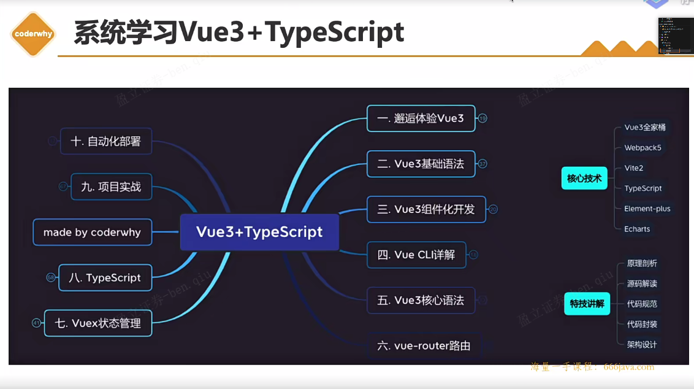
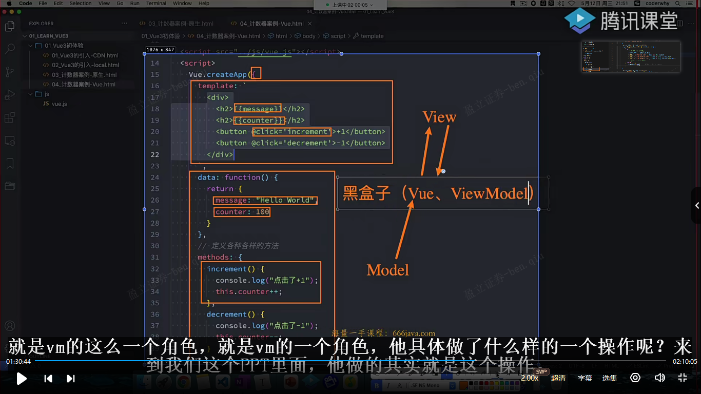

# 01-邂逅Vue3

## 简介

Angular入门门槛高，设计思想与node框架nest.js相似，而且都是用typescript编写




## Vue3库引入使用


> CDN这么看跟域名解析过程有点像，递归查找并缓存


## 计数器案例（原生 & Vue 实现）


> 挂载元素后面可以配置代码片段来快速生成


在template中，vue3最外层给不给div标签都可以，vue2是要的

> 暂时不清楚上图说的另一方式编写有提示指的是什么（答：在template标签进行）

​	

## 编程范式

分为：

- 命令式编程（原生html）：当下最需要什么去声明然后直接用（获取dom由人完成）
- 声明式编程（Vue）：把需要的东西先声明后绑定进行使用（获取dom由框架完成）


## MVVM & MVC

前端除了MVVM架构，也可以当成MVC架构来看


但MVC这种传统开发模式在前端划分不会那么清晰，不像后端/ios



vue算是MVVM框架，整个设计受到它的启发

vue作为中间层，帮助实现数据双向绑定和dom操作


## template属性

绑定元素标签数据只能是在template标签里绑定数据的，template标签外的不能识别处理（例如单纯在body标签下使用 <div>{{ message }}</div> 类似这种）


在vue中挂载或者绑定标签通常使用id进行绑定/挂载是有含义的，


template标签不是vue特有的，html标签本身就有定义这个template标签，而且它里面的内容默认情况下不会被浏览器渲染，那么它有什么作用呢？

> 作用：被javascript源代码读取，在scirpt标签里去用

^00ee8c

[MDN | <template>：内容模板元素](https://developer.mozilla.org/zh-CN/docs/Web/HTML/Element/template)

虽然解析器在加载页面时确实会处理 **`<template>`** 元素的内容，但这样做只是为了确保这些内容有效；但元素内容不会被渲染。——MDN

---


如果用的不是template标签而是其他标签（例如div标签），那么页面会被渲染两次的（一次是原生渲染一次是经过vue处理后渲染），为什么会这样？

> 上面刚刚已经说明了原因，template标签是不会被浏览器渲染（看上面写的[[note#^00ee8c | template作用]]）


## methods属性

绑定到template标签或者template内的标签都可以

 ^3436ef


## 源码调试

vue3源码地址：https://github.com/vuejs/core

### 流程

1. git clone git@github.com:vuejs/core.git
2. 新版本的vue3源码采用pnpm管理，而非yarn，先下载pnpm
3. 安装依赖 `pnpm install`
4. 打包vue文件 `pnpm dev` 生成打包文件到 `built: packages\vue\dist\vue.global.js`，而后可直接引用
5. 在 `packages\vue\examples` 中新建你自己的调试目录，然后在调试目录里面新建html文件
5. 在根目录下的package.json中的dev值后面添加 `--sourcemap`，便于代码映射（不然调试在几万多行的vue.global.js调试，肯定是一头雾水的）


sourcemap有代码映射作用，映射vue.global.js 文件的目标代码具体是源码的哪个目录位置去


有map后缀文件说明sourcemap生效

**Coderwhy_Vue3-Typescript\src\01_Vue3初体验\core\packages\vue\examples\why\demo.html**

```html
<!DOCTYPE html>
<html lang="en">
<head>
  <meta charset="UTF-8">
  <meta name="viewport" content="width=device-width, initial-scale=1.0">
  <title>Document</title>
</head>
<body>
  <div id="app">写在#app的这一部分内容会被template标签的内容所替换</div>

  <script src="../../dist/vue.global.js"></script>

  <script>
    debugger
    Vue.createApp({
      template: '<h2>我来啦！</h2>',
    }).mount('#app')
  </script>
</body>
</html>
```


​	

# 02-Vue3模板语法

## 上节课后题

先看看[[note#^3436ef | 第一课-课后思考题]]

{ } 大括号并不全是作用域，建议看看作用域的文章

**{ } 大括号是作用域吗？**

> 是的，大括号 `{}` 在许多编程语言中用于创建作用域（Scope）。作用域定义了变量、函数和对象的可见性和访问权限。
>
> 在大多数编程语言中，例如 JavaScript、Java、C++、C# 等，大括号用于创建块级作用域。在这些语言中，当您在代码中使用大括号时，大括号将创建一个新的作用域，在其中可以定义局部变量和函数。
>
> 例如，在 JavaScript 中：
>
> ```javascript
> {
>   // 这里是一个块级作用域
>   const x = 10;
>   console.log(x); // 输出 10
> }
> 
> console.log(x); // 报错，x 在此作用域外不可见
> ```
>
> 在上面的代码中，大括号 `{}` 创建了一个块级作用域，其中定义了变量 `x`。在作用域内，可以访问和使用该变量。但是，在作用域外，尝试访问 `x` 将导致错误，因为它不在当前作用域的范围内。
>
> 请注意，**不是所有的大括号都会创建作用域**。例如，在对象字面量中的大括号 `{}` 用于定义对象的属性和方法，但它们不会创建新的作用域。
>
> 总之，大括号 `{}` 在许多编程语言中用于创建作用域，提供了变量和代码的封闭环境，控制了变量的可见性和生命周期。


[coderwhy老师微信公众号推文 | 前端面试之彻底搞懂this指向](https://mp.weixin.qq.com/s/hYm0JgBI25grNG_2sCRlTA) ^5e5364

> 简单讲一下 call、bind、apply，这三个都是显式指定this指向
>
> - call和apply的区别是：call传入单参数，apply传入数组参数
>
> - call和apply 与 bind 的区别是：call和apply是一次性绑定，apply是永久绑定某对象/方法的this指向
> - bind是原型对象上的方法，当然也可以自己封装，原理是利用闭包返回apply函数进行绑定，原理看[[note#^5e5364 | 推文]]有详细介绍
> - setTimeout中会传入一个函数，这个函数中的this通常是window，为什么是window呢？因为setTimeout内部是通过apply进行绑定的this对象，并且绑定的是全局对象；

```
这样的闭包会被销毁吗？

foo3: function () {
    return function () {
      console.log(this.name)
    }
  },
```

> 在给定的代码中，`foo3` 方法返回一个闭包函数。闭包函数保留对其创建时所在的词法环境的引用，即使创建它的外部函数已经执行完毕。因此，闭包函数会继续存在并保持对其创建时的作用域和变量的访问。
>
> 当调用 `foo3` 方法时，返回的闭包函数会被赋值给一个变量或直接调用。无论哪种情况，该闭包函数都会继续存在并保持对其词法环境的引用。只有当没有任何引用指向该闭包函数时，它才会被垃圾回收器回收并销毁。
>
> 对于给定的闭包函数，它引用了 `this.name`，但是在闭包函数中的 `this` 指向取决于如何调用该函数。如果以对象方法的形式调用闭包函数，例如 `obj.foo3()`，那么 `this` 将指向 `obj`，并且能够访问 `obj` 对象的 `name` 属性。
>
> 例如：
>
> ```javascript
> var obj = {
> name: "example",
> foo3: function () {
>  return function () {
>    console.log(this.name);
>  };
> },
> };
> 
> var closure = obj.foo3();
> closure(); // 输出 "example"
> ```
>
> 在上面的示例中，`closure` 是 `foo3` 返回的闭包函数。当调用 `closure()` 时，`this` 指向 `obj`，并成功输出了 "example"。
>
> 总结起来，闭包函数只有在没有任何引用指向它时才会被销毁。在上述示例中，只有当没有任何引用指向返回的闭包函数时，它才会被垃圾回收器回收。
>
> **只有当没有任何引用指向返回的闭包函数时，它才会被垃圾回收器回收。这句话怎么理解？能不能举个例子**
>
> > 当一个函数被创建并返回后，如果其他变量或函数仍然引用该函数，那么该函数就有一个活跃的引用，垃圾回收器不会将其回收。只有当没有任何变量或函数引用该函数时，垃圾回收器才会将其标记为不再需要，并在适当的时候进行回收。
> >
> > 以下是一个示例来说明这个概念：
> >
> > ```javascript
> > function createClosure() {
> >   var name = "example";
> > 
> >   var closure = function() {
> >     console.log(name);
> >   };
> > 
> >   return closure;
> > }
> > 
> > var closureReference = createClosure();
> > closureReference(); // 输出 "example"
> > ```
> >
> > 在上面的示例中，`createClosure` 函数创建了一个闭包函数，并将其赋值给 `closureReference` 变量。即使 `createClosure` 函数已经执行完毕，闭包函数仍然存在，并且保持对 `name` 变量的引用。因此，当调用 `closureReference` 函数时，它仍然可以访问并输出 `name` 的值。
> >
> > 在这种情况下，闭包函数 `closure` 有一个活跃的引用，因为它被赋值给了 `closureReference` 变量。只有当没有任何变量引用该闭包函数时，垃圾回收器才会将其回收。例如，如果将 `closureReference` 设置为 `null` 或将其赋值为其他值，那么闭包函数就没有任何引用了，最终会被垃圾回收器回收。
> >
> > ```javascript
> > closureReference = null; // 解除对闭包函数的引用
> > ```
> >
> > 一旦没有任何引用指向闭包函数，它就可以被垃圾回收器回收，释放内存资源。
> >
> > 总结起来，只有当没有任何变量或函数引用一个闭包函数时，它才会被垃圾回收器回收。
>
> **面试题-小试牛刀(代码注释看[[note#^5e5364 | 推文]])**
>
> ```js
> var name = 'window'
> var person1 = {
>   name: 'person1',
>   foo1: function () {
>     console.log(this.name)
>   },
>   foo2: () => console.log(this.name),
>   foo3: function () {
>     return function () {
>       console.log(this.name)
>     }
>   },
>   foo4: function () {
>     return () => {
>       console.log(this.name)
>     }
>   }
> }
> 
> var person2 = { name: 'person2' }
> 
> person1.foo1();   // person1
> person1.foo1.call(person2); // person2
> 
> person1.foo2(); // window
> // foo2依然是箭头函数，不适用于显示绑定的规则
> person1.foo2.call(person2); // person2 x window
> 
> person1.foo3()(); // window
> // 但是拿到的返回函数依然是在全局下调用，所以依然是window
> person1.foo3.call(person2)(); // person2 x window
> person1.foo3().call(person2); // person2
> 
> // foo4()的函数返回的是一个箭头函数
> // 箭头函数的执行找上层作用域，是person1
> person1.foo4()(); //window x person1
> person1.foo4.call(person2)(); //person2
> // foo4返回的是箭头函数，箭头函数只看上层作用域
> person1.foo4().call(person2); // person2 x person1
> ```
>
> 做得一塌糊涂...
>
> ```js
> var name = 'window'
> function Person (name) {
>   this.name = name
>   this.foo1 = function () {
>     console.log(this.name)
>   },
>   this.foo2 = () => console.log(this.name),
>   this.foo3 = function () {
>     return function () {
>       console.log(this.name)
>     }
>   },
>   this.foo4 = function () {
>     return () => {
>       console.log(this.name)
>     }
>   }
> }
> var person1 = new Person('person1')
> var person2 = new Person('person2')
> 
> person1.foo1() // person1
> person1.foo1.call(person2) //person2
> 
> // foo是一个箭头函数，会找上层作用域中的this，那么就是person1
> person1.foo2() // window x person1
> person1.foo2.call(person2) // person1
> 
> person1.foo3()() // window
> person1.foo3.call(person2)() // window
> person1.foo3().call(person2) // person2
> 
> person1.foo4()() // person1
> // foo4调用时绑定了person2，返回的函数是箭头函数，调用时，找到了上层绑定的person2
> person1.foo4.call(person2)() // window x person2
> person1.foo4().call(person2) // person1
> ```
>
> ```js
> var name = 'window'
> function Person (name) {
>   this.name = name
>   this.obj = {
>     name: 'obj',
>     foo1: function () {
>       return function () {
>         console.log(this.name)
>       }
>     },
>     foo2: function () {
>       return () => {
>         console.log(this.name)
>       }
>     }
>   }
> }
> var person1 = new Person('person1')
> var person2 = new Person('person2')
> 
> // obj.foo1()返回一个函数
> // 这个函数在全局作用于下直接执行（默认绑定）
> person1.obj.foo1()() // obj | person1 x window
> person1.obj.foo1.call(person2)() // window
> person1.obj.foo1().call(person2) // person2
> 
> // 拿到foo2()的返回值，是一个箭头函数
> // 箭头函数在执行时找上层作用域下的this，就是obj
> person1.obj.foo2()() // obj | person1 -> obj
> // foo2()的返回值，依然是箭头函数，但是在执行foo2时绑定了person2
> // 箭头函数在执行时找上层作用域下的this，找到的是person2
> person1.obj.foo2.call(person2)() // person1 x person2
> // 箭头函数通过call调用是不会绑定this，所以找上层作用域下的this是obj
> person1.obj.foo2().call(person2) // person1 x obj
> ```

**小结**：this的四种绑定规则

1. 默认规则绑定（全局window）
2. 隐式绑定（谁调用就是绑定谁）
3. 显示绑定（call、bind、apply）
4. new绑定

以上优先级从高到低为 4-3-2-1

---

## @click="btnClick"，怎么做绑定的？（源码解析）


绑定的大致思路（详情看视频第二集36min-38min有介绍）：通过循环（for...in）methods，判断是否有该方法，有的话通过bind函数绑定this存储到ctx[key]（这个是存储方法的，例如btnClick），publicThis指向的是我们组件实例的代理proxy对象（见下图（这个在后面响应式原理会讲到））


## template解析方法（后面详讲）

有两种，在vue源码内解析和vue-template-compiler（vue插件）解析

`instance.proxy"!"`，这是ts的语法，表示断言

proxy是es6新出的

## VSCode代码片段

