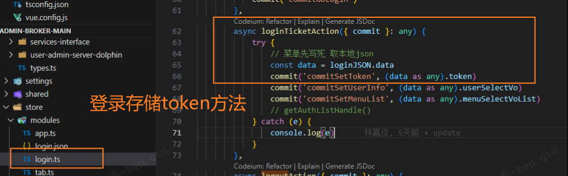

（D:\Repository\h5\admin-broker-capital\src\pages\views\user-manage\index.vue）用户管理中的回显接口存在问题bug，如需要跟后端进行沟通，修改属性初始化要求（例如不能为空更改为允许，放宽限制），更新接口调用可以将数据添加到回显接口上，但是创建用户的接口调用，回显接口里的数据仍然为null，需要调用一次更新接口才行

--

不是bug，是个人能力的问题，公司有封装基础组件，你不会用而已，同时点击每一个，row是直接获取当前对象数据，而不是像获取接口数据一样，返回给你所有数据自己二次封装筛选，这样就太麻烦了，前任造轮子直接用就行