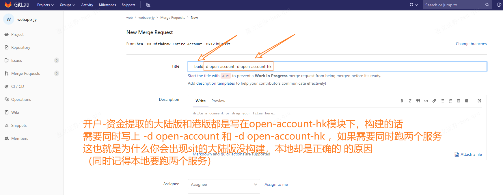

开发才需要合并到dev分支，维护是合并到sit分支

```txt
调用接口数据成功的话，获取的不是整个响应的数据，而是响应中data的数据，因为成功的话其他数据不需要用到哩

try-catch-finally，很好用，如果你调用接口获取不到数据或者提交表单和数据库中数据不匹配的话，会直接进入catch，catch接受一个error参数，可以在catch中打印这个error，最后可以做finally处理，finally是一定会执行的一个操作，例如我们调用接口获取数据时，加载this.$loading()这个方法（这个是加载动画），然后我们可以在finally中执行this.$close()来关闭加载动画，即使我们忘记在try中加载this.$close()也没关系（或者try中执行接口调用后失败跳转到catch导致try中最后this.$close()没执行也不要紧），finally帮我们兜底了
```

​	

港版开户-提取资金相关网址

- http://localhost:8080/webapp/open-account-hk/withdrawal.html#/funds?id=844353945070350336

- http://m-sit.yxzq.com/webapp/open-account-hk/withdrawal.html?firstLogin=null#/funds?id=844353945070350336（sit线上环境）




合并生产master分支需要加上 -i，有推送信息