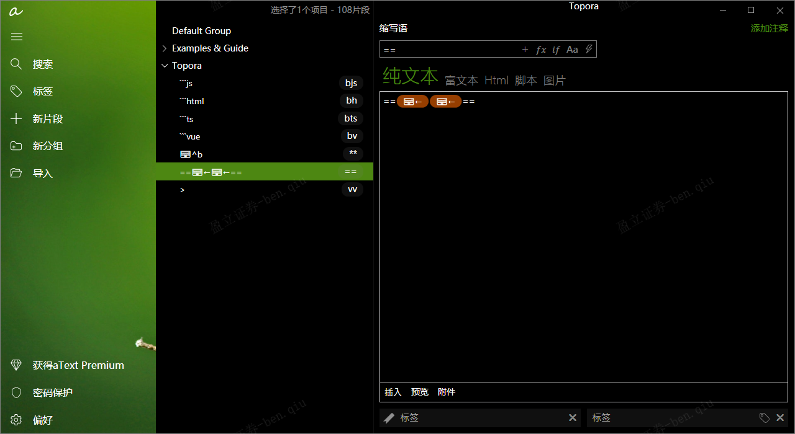
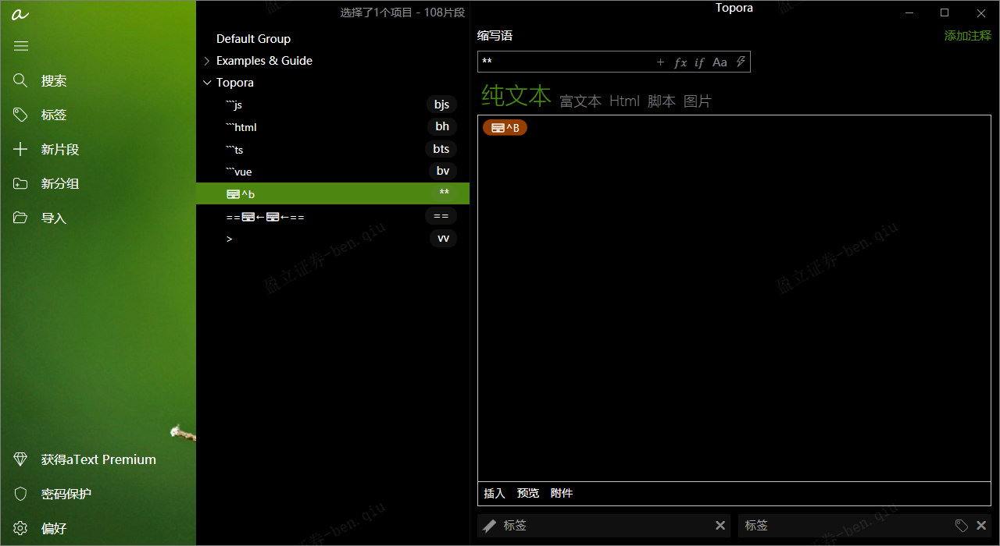

## [Windows 文字效率工具有了新选择：aText](https://sspai.com/post/57350)

## [aText官网](https://www.trankynam.com/atext/)

## v-for可以在div标签使用吗？

是的，`v-for` 可以在 `<div>` 标签中使用。`v-for` 是 Vue.js 中的一个指令，用于循环渲染列表数据。

你可以将 `v-for` 放置在 `<div>` 标签上，或者放在任何其他标签上，以遍历一个数组或对象，并根据数据的每个元素重复渲染相应的内容。

例如，假设你有一个包含用户列表的数组，你可以在 `<div>` 标签上使用 `v-for` 来渲染每个用户的信息：

```html
<template>
  <div>
    <div v-for="user in users" :key="user.id">
      <!-- 在这里显示用户信息 -->
      <p>{{ user.name }}</p>
      <p>{{ user.email }}</p>
    </div>
  </div>
</template>

<script>
export default {
  data() {
    return {
      users: [
        { id: 1, name: 'Alice', email: 'alice@example.com' },
        { id: 2, name: 'Bob', email: 'bob@example.com' },
        { id: 3, name: 'Charlie', email: 'charlie@example.com' }
      ]
    };
  }
};
</script>
```

在上面的例子中，`v-for="user in users"` 循环遍历 `users` 数组，并将每个用户的信息渲染在 `<div>` 中。注意 `:key="user.id"` 是必需的，它用于给每个循环项添加唯一的 key，以优化 Vue.js 的渲染性能。

​	

伤心，这两个用不了，要付费会员，买断制200+





​	

如果不想要一个项目里有多个.git导致错乱，可以不用 `git clone` ，直接下载压缩包就行